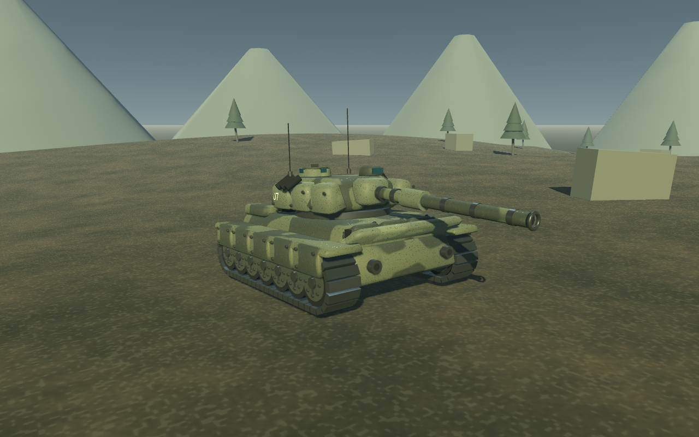
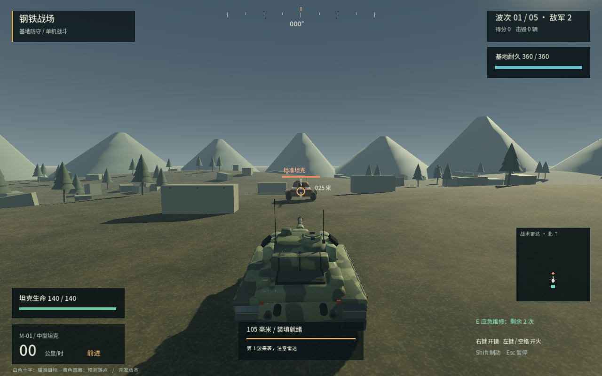

# 钢铁战场 — 第三人称坦克原型

独立的单机 3D 坦克驾驶、射击与基地防守游戏原型。当前为程序模型增强版：已加入斜面装甲、动态履带、磨损迷彩与开火特效；仍属于玩法原型，未使用正式美术资产，也没有联网、账号或职业系统。



## 本机试玩

在 Finder 中双击 `launch.command`，然后点击 **开始基地防守**，或选择 **自由训练**。

也可以在仓库目录运行：

```sh
./launch.command
```

本机引擎位于 `work/tools/Godot.app`，来自 Godot 官方 4.7.2 stable。`work/` 不进入版本控制。其他电脑需要先安装标准版 Godot 4.7.2，打开 `project.godot`，按 F6/F5 运行；不需要 .NET。

## 操作

| 按键 | 功能 |
|---|---|
| W / S | 前进 / 倒车 |
| A / D | 车体左转 / 右转，允许原地转向 |
| 鼠标移动 | 旋转观察方向，炮塔按限速追踪 |
| 鼠标左键 / 空格（可按住） | 发射，装填时间 2.3 秒 |
| 鼠标右键（按住） | 开镜瞄准，降低鼠标灵敏度 |
| 滚轮 | 调整第三人称镜头距离 |
| Shift | 制动 |
| Esc | 暂停 / 恢复，释放 / 捕获鼠标 |
| E | 基地防守中应急维修，每局 2 次 |
| R | 重建战场，回到主菜单 |

白色十字表示相机瞄准目标，黄色圆圈表示当前炮口弹道的预测落点；炮塔转动、俯仰限位和重力会使它们不同。炮管被掩体挡住时会提示 **炮口被掩体遮挡**。靶标需要两发摧毁，清除 6 个靶标后显示完成提示。

## 基地防守



守住身后的指挥基地，击退 5 波共 18 辆敌军即获胜。玩家或基地被摧毁即失败。

- 轻型、标准、重型敌军有不同速度、生命和射速，会绕过静态掩体、接近玩家或基地并射击。最多同时出现 4 辆。
- 玩家初始生命 140，基地耐久 360。坦克正面承受 65% 伤害，后方承受 140%，侧面正常；利用掩体和侧翼攻击。
- **E 应急维修**每次恢复最多 40 生命，每局 2 次，满血不消耗。
- 击毁敌军掉落补给：绿色维修箱恢复最多 30 生命，金色补给提供 12 秒装填加速。靠近自动拾取，40 秒后消失。
- 每波结束选择一项强化：装甲（最大生命 +30、维修 +45）、装填（时间缩短 14%）或机动（最高速度 +15%、维修 +15）。
- 中文 HUD 显示生命、基地耐久、波次、敌军数量、分数和维修次数。右下雷达北向朝上，显示全场敌军和基地。
- 暂停冻结战斗与计时；结算显示得分、击毁数量、时长及射击命中统计。R 可随时返回主菜单重新开始。

## 当前实现

- 240 × 240 米的起伏地形，坡地具有真实三角网格碰撞。
- 可加减速、倒车和原地转向的坦克；车体外观随坡面调整。
- 独立炮塔及炮管，炮塔约 52°/秒，俯仰 -9° 至 +22°。
- 跟车镜头、球形弹簧臂避障、镜头距离调节和开镜。
- 从炮口挂点发射，115 米/秒初速、重力下坠、逐帧线段扫掠碰撞。
- 发射前检查炮膛到炮口的遮挡，避免炮管穿过掩体后从另一侧出弹。
- 6 个静止训练靶、命中和摧毁反馈、装填提示、合成炮声。
- 多面车体和炮塔、分块装甲、螺栓、观察镜、炮口内壁、灯具与编号。
- 迷彩、漆面颗粒、金属磨损；双侧独立循环履带节与轮组动画。
- 炮管后坐复位、炮口闪光与局部照明、炮烟、撞击火星、扬尘与排气。
- 冷暖双向照明和程序地表纹理。
- 暂停、失焦暂停、战场重置和跌落复位。

## 验证

```sh
./scripts/check.sh
```

测试引擎可通过 `GODOT_BIN=/path/to/godot ./scripts/check.sh` 指定。共 90 项自动检查，另含工程导入与启动冒烟验证。检查包括：工程导入、6 项弹道/限位检查、27 项实际场景检查、12 项模型/动画/特效检查、5 项方向装甲规则、37 项基地防守集成检查、3 项持续 AI 实战模拟及启动冒烟测试。测试不会改变用户存档，也不访问网络。

使用真实渲染器生成菜单和游戏截图：

```sh
./launch.command --script tests/visual.gd
```

坦克近景、开火和烟尘截图：

```sh
./launch.command --script tests/presentation_visual.gd
```

基地防守菜单、战斗、强化与结算截图：

```sh
./launch.command --script tests/battle_visual.gd
```

截图写入被忽略的 `outputs/`。这会短暂打开测试窗口；用于截图的近景相机属于测试工具，正常驾驶镜头仍为第三人称。

已在本机 Apple M4 / macOS 上运行与截图验证。Windows、Linux 的导出和实机验证尚未进行；Android 和 iOS 后续再适配。尚无独立发行包、签名或公证。

## 文件结构

- `scripts/battle_director.gd`：基地、波次、补给、强化与胜负结算。
- `scripts/enemy_controller.gd` / `battle_navigation.gd`：敌军瞄准射击与静态寻路。
- `scripts/enemy_visual.gd`：三种敌军的轻量程序模型。
- `scripts/main.gd`：输入、镜头、炮弹、命中与游戏状态。
- `scripts/tank.gd`：驾驶、碰撞、坡面姿态与炮塔跟踪。
- `scripts/tank_visual.gd`：程序坦克模型、独立履带和后坐动画。
- `scripts/armor_geometry.gd`：带斜面和倒角的装甲几何。
- `scripts/battle_effects.gd`：有数量上限的粒子与炮口灯光。
- `shaders/`：程序装甲和地表材质。
- `scripts/battlefield.gd`：地形、掩体和靶标。
- `scripts/combat_math.gd`：重力弹道及俯仰限制。
- `scripts/hud.gd`：菜单、准星、驾驶和战斗信息。
- `tests/`：数学、实际物理场景和视觉截图检查。

## 原型限制

- 敌军采用静态栅格寻路与倒车脱困，复杂拥挤场景仍可能卡住；没有动态编队、团队协同或难度自适应。
- 当前为单局进度，退出或重开会清除分数与强化；尚无存档、联网或职业系统。

- 当前车体碰撞保持直立，只有外观随坡面倾斜；不是独立悬挂或完整履带物理。
- 岩石和掩体使用简化碰撞；装饰树木及远山不参与战斗碰撞。战场边缘有边界墙。
- 当前炮弹按点轨迹扫掠，不包含口径体积、跳弹或穿甲模型。
- 预测落点使用固定时间步，边缘擦碰可能与逐帧实际弹道有细微偏差。
- 画面仍为程序资产原型，与参考宣传图的精细建模、真实贴图及电影级光照存在差距；远山、植被和掩体仍是简化资产。
- 动态履带属于视觉动画，不包含逐节刚体碰撞或真实悬挂。烟尘与火星不影响弹道。
- 后坐只作用于炮管外观，逻辑炮口保持稳定；发射瞬间使用后坐前的炮口位置。
- 特效最多保留 180 个粒子和 4 组短时闪光，暂停时冻结并在到期后回收。
- 界面为简体中文；内置 Noto Sans SC 字体，避免依赖系统中文字体。字体按 SIL Open Font License 1.1 使用，许可见 `assets/fonts/OFL.txt`。

旧项目仅作玩法参考；没有搬入旧项目代码，也没有修改旧仓库。用户已授权推送新仓库；当前开发分支为 `prototype/first-playable`。未部署。

字体来源：[Google Fonts / Noto Sans SC](https://github.com/google/fonts/tree/main/ofl/notosanssc)。
